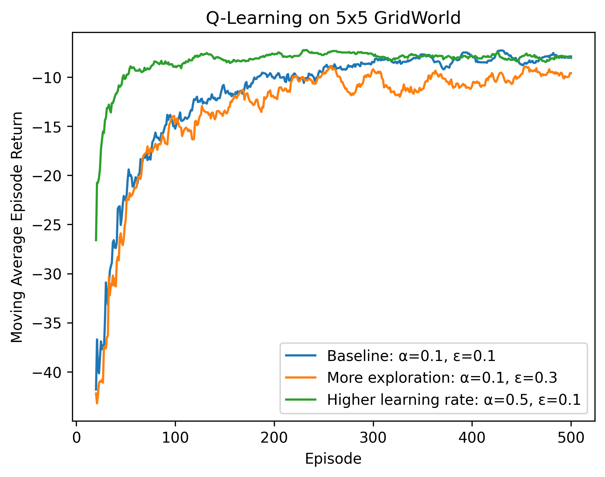
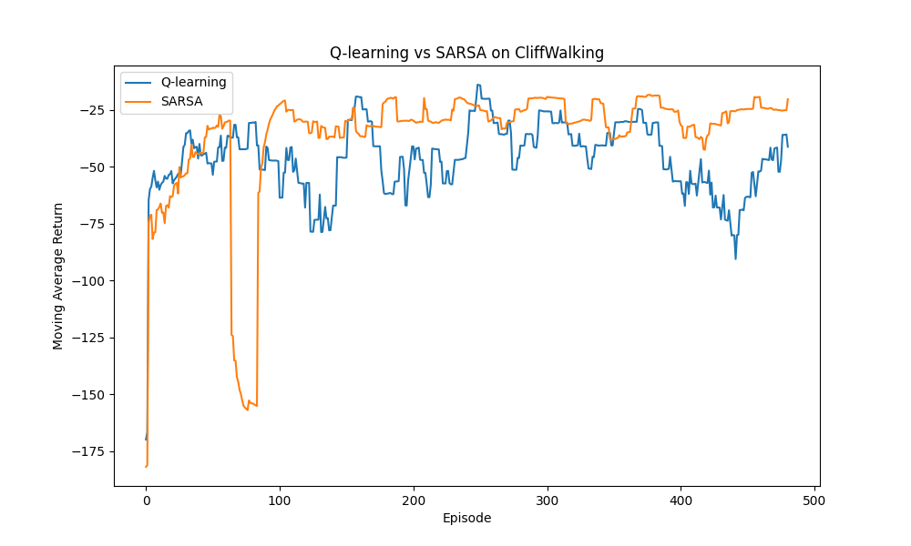
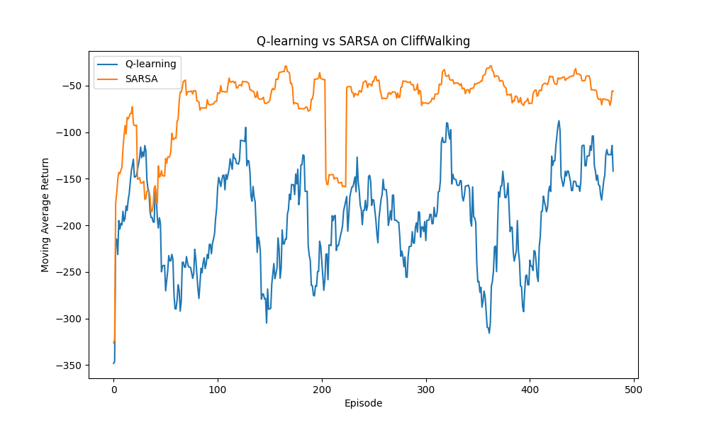

# Reinforcement Learning from Scratch

A small reinforcement learning project implementing tabular temporal-difference control algorithms from scratch with Python, NumPy, Matplotlib, and Gymnasium.

The project starts with a custom deterministic 5×5 GridWorld, then extends to Gymnasium's CliffWalking environment to compare Q-learning and SARSA.

## What I Implemented

- Custom deterministic 5×5 GridWorld
- Tabular Q-learning from scratch
- Epsilon-greedy exploration
- Hyperparameter experiments for learning rate and exploration rate
- Gymnasium `reset()` / `step()` interaction loop
- Q-learning on `CliffWalking-v0`
- SARSA on `CliffWalking-v0`
- Greedy policy evaluation
- Moving-average learning curves
- Q-learning vs. SARSA comparison under different exploration rates

## Core Algorithms

### Q-learning

Q-learning is off-policy. Its target is:

`target = reward + gamma * max(Q[next_state])`

It learns toward the greedy next action even while the behavior policy uses epsilon-greedy exploration.

### SARSA

SARSA is on-policy. Its target is:

`target = reward + gamma * Q[next_state, next_action]`

The next action is selected by the same epsilon-greedy behavior policy used during training.

## Custom GridWorld Experiments

I compared three Q-learning configurations over 500 episodes:

| Experiment | Alpha | Epsilon | Purpose |
|---|---:|---:|---|
| A | 0.1 | 0.1 | Baseline |
| B | 0.1 | 0.3 | More exploration |
| C | 0.5 | 0.1 | Higher learning rate |



Main observations:

- Higher learning rate accelerated learning in this small deterministic environment.
- More exploration worsened training return because the agent selected random actions more often.
- All three settings learned an optimal 8-step greedy policy.
- Training performance can differ from final greedy-policy performance because training includes exploration.

## CliffWalking: Q-learning vs. SARSA

Both algorithms were trained for 500 episodes with:

- `alpha = 0.5`
- `gamma = 1.0`
- `seed = 42`
- `epsilon = 0.1` and `epsilon = 0.3`

At `epsilon = 0.3`:

- Q-learning greedy evaluation: **13 steps**, return **-13**
- SARSA greedy evaluation: **17 steps**, return **-17**

Q-learning learned the shortest path directly above the cliff. SARSA learned a longer but safer route because its on-policy update incorporates the risk created by epsilon-greedy exploration.

### Epsilon = 0.1



### Epsilon = 0.3



With higher exploration, Q-learning's training returns became substantially worse and more variable because exploratory actions near the cliff often caused `-100` penalties. SARSA remained safer because exploration risk affects its learned action values.

See [`summary.md`](summary.md) for the experiment discussion.

## Repository Files

- `gridworld.py` — custom 5×5 environment
- `q_learning.py` — Q-learning on the custom GridWorld
- `cliff_q_learning.py` — Q-learning using Gymnasium CliffWalking
- `sarsa.py` — SARSA using Gymnasium CliffWalking
- `cliff_compare.py` — trains and compares Q-learning and SARSA
- `figures/q_learning_comparison.png` — custom GridWorld experiments
- `learning_curve.png` — CliffWalking comparison with lower exploration
- `learning_curve_epsilon_03.png` — CliffWalking comparison with higher exploration
- `summary.md` — research-style experiment summary

## Setup

```bash
python -m venv .venv
source .venv/bin/activate
pip install -r requirements.txt
```

Run the CliffWalking comparison:

```bash
python cliff_compare.py
```

## Main Takeaway

The project demonstrates why on-policy and off-policy learning can produce different behavior even in a small tabular environment. Q-learning optimizes toward the greedy policy, while SARSA learns values for the behavior policy it actually follows during training.
